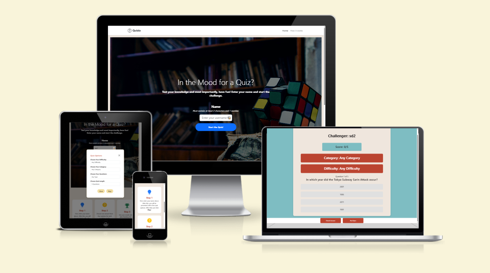

# Quizia

## Introduction

Quizia is an interactive online quiz application built during a hackathon by the **Quizia team**.
It was developed collaboratively to challenge users’ general knowledge as well as subject-specific topics, while showcasing teamwork, design thinking, and rapid prototyping.

Designed with accessibility and replayability in mind, Quizia appeals to a broad audience (recommended age 13+). Users can tailor their experience by adjusting difficulty, quiz length, and subject matter, ensuring that each session feels fresh and engaging.

---

## Mockup – Responsive Design

Quizia is built with a responsive design to ensure a smooth user experience across all devices, from desktop to mobile.

>  > **Key Points:**

-   **Desktop:** Full immersive layout with rich background and clear navigation.
-   **Tablet:** Optimized quiz options modal and step-by-step guide.
-   **Mobile:** Clean interface with easy-to-tap buttons, ensuring accessibility and fast play.
-   **Consistency:** Visual identity and quiz flow remain the same on all screen sizes.

## 🚀 Features

## Navigation Bar

> 

Quizia features a **minimal navigation bar** to keep the interface clean and user-friendly.
It includes the application logo and quick access links for smooth navigation.

**Key Features:**

-   **Logo:** Positioned on the left side with a simple icon and the app name (_Quizia_).
-   **Links:** _Home_ and _How it works_ for fast access to the main sections.
-   **Design:** Lightweight, unobtrusive, and consistent across all pages.

## Homepage

The homepage of **Quizia** is designed to welcome new users and guide them straight into the quiz experience.

**Key Elements:**

-   **Hero Title:** _“In the Mood for a Quiz?”_ — a clear and inviting headline.
-   **Subtitle:** Encourages users to test their knowledge and have fun.
-   **Name Input Field:**
    -   Requires at least **2 characters** and **1 number** for validation.
    -   Placeholder: _“Enter your username 🦉”_.
-   **Start Button:** A bold, high-contrast call-to-action button: _“Start the Quiz!”_.
-   **Background:** A bookshelf image symbolizing knowledge, paired with a Rubik’s Cube to represent challenge and problem solving.

> 

## How It Works

Quizia keeps the user journey simple and engaging, guiding players through three clear steps:

-   **Step 1 – Enter Your Name**
    Users start by entering their name. After this, they are presented with quiz options such as category, difficulty, and quiz length. Once ready, they simply click **Play!**

-   **Step 2 – Answer Questions**
    Each quiz question offers four possible answers (or True/False mode). Only one answer is correct, making the gameplay straightforward yet challenging.

-   **Step 3 – View Results & Share**
    Once the quiz ends, results are shown instantly. Players can then challenge friends to beat their score, encouraging replayability and social engagement.

> 

## Footer

Quizia includes a clean footer at the bottom of homepage to provide users with quick access to social channels and legal information.

> 

## Quiz Options

Before starting the quiz, users are presented with a **Quiz Options** modal that allows them to customize their experience.

**Available Options:**

-   **Choose Your Difficulty:** Select from multiple levels or keep it as _Any Difficulty_.
-   **Choose Your Category:** Pick a specific topic or keep it general (_Any Category_).
-   **Choose Your Questions:** Decide between question types (e.g., Multiple Choice, True/False).
-   **Choose Quiz Length:** Define how many questions to play (default: 5).

**Controls:**

-   **Play!** – starts the quiz immediately with the chosen options.
-   **Close** – dismisses the modal and returns to the homepage.

> 

## Quiz Gameplay

Once the quiz begins, players are presented with a clean and focused interface that makes answering questions intuitive and engaging.

**Interface Features:**

-   **Player Name:** Displayed at the top (e.g., _Challenger: Adam32_) for a personalized experience.
-   **Score Tracker:** Shows progress and current score (e.g., _Score: 0/5_).
-   **Category & Difficulty:** Highlighted in colored banners to remind users of their chosen settings.
-   **Question Display:** Each question is clearly stated with four possible answers.
-   **Answer Options:** Players select one option per question (only one is correct).
-   **Controls:**
    -   **Check Answer** – submit the selected option.
    -   **End Quiz** – exit the quiz before completion if desired.

**Gameplay Flow:**

1. A question appears along with multiple-choice answers.
2. The user selects an answer and clicks **Check Answer**.
3. The app evaluates correctness, updates the score, and moves to the next question.
4. This repeats until the quiz ends.

> 

## Quiz Results

After completing a quiz, players are shown a clear results page that provides instant feedback on their performance.

**Key Features:**

-   **Congratulations Message:** Positive reinforcement for completing the quiz.
-   **Final Score:** Displays the player’s score (e.g., _Adam32, your Final Score is: 3_).
-   **Questions Answered:** Shows how many questions were attempted out of the total (e.g., _5 Questions_).
-   **Replay Option:** A **Play Again** button encourages replayability by letting users immediately start another quiz.
-   **Friendly Closing Note:** Thanks the player for participating, enhancing user engagement.

> 
